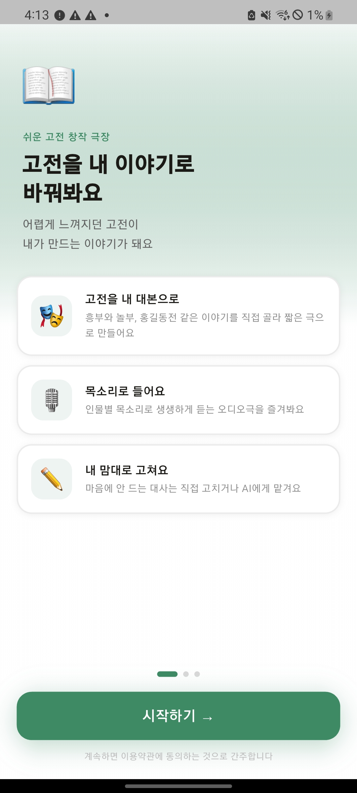
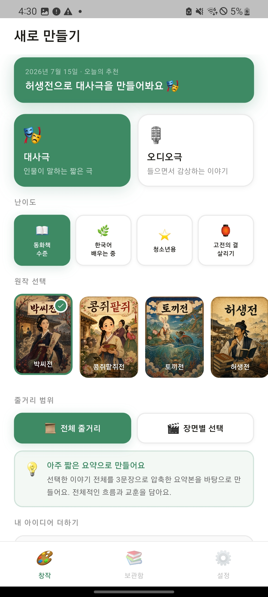
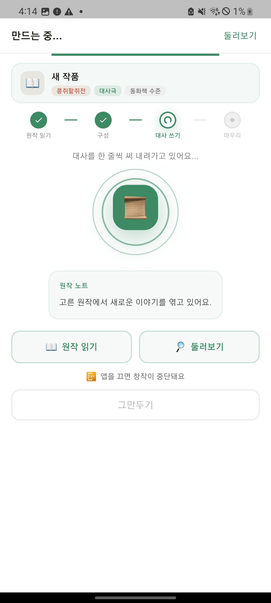
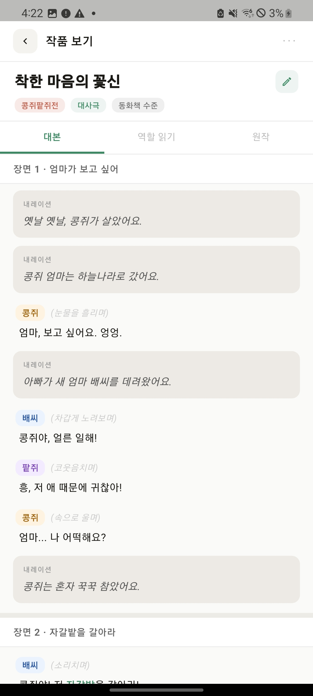
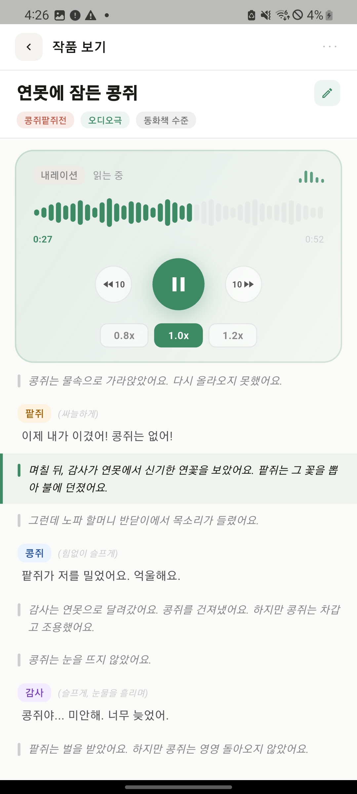
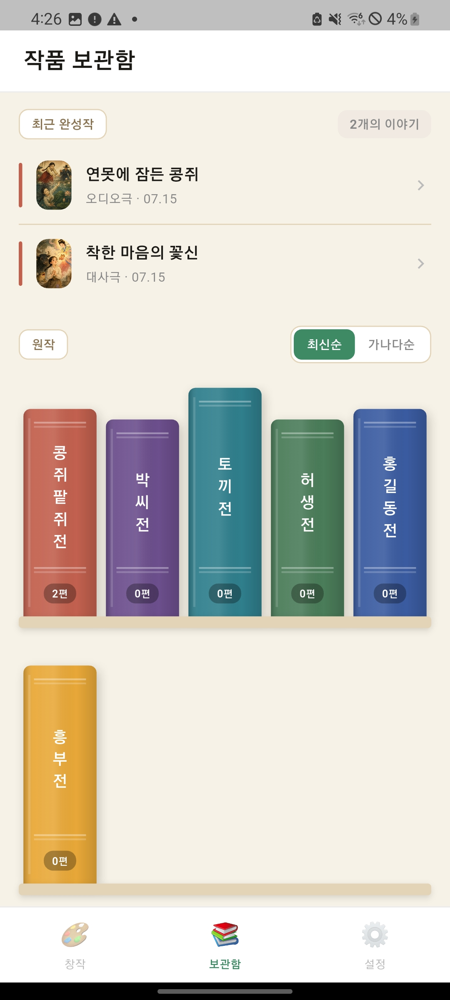
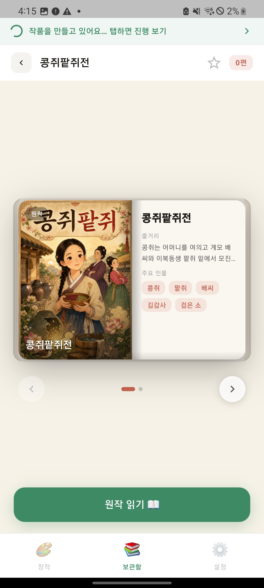

<p align="center">
  
</p>

<h1 align="center">쉬운고전 (Easy Classics)</h1>

<p align="center">
  고전문학을 대사극·오디오극으로 쉽게 재창작해서 읽고 듣는 Flutter 앱<br/>
  A Flutter app that turns Korean classic literature into easy-to-read dialogue plays and audio dramas
</p>

<p align="center">
  
  
  
  
  
</p>

<p align="center">
  <a href="#-한국어">한국어</a> ·
  <a href="#-english">English</a>
</p>

---

## 🇰🇷 한국어

### 소개

**쉬운고전**은 흥부전·홍길동전·박씨전 등 한국 고전문학을 사용자가 고른 난이도·모드로 재창작해서
**대사극(스크립트)** 또는 **오디오극(TTS 음성)** 으로 감상하는 크로스플랫폼(Android/iOS) 모바일 앱입니다.
회원가입 없이 게스트로 바로 사용하며, 어려운 단어는 탭하면 뜻·한자·설명을 바로 보여주고, 생성한 창작물은
"내 서재"에서 CRUD로 관리합니다.

> 이 저장소는 **팀 해커톤(문화 콘텐츠 공모전) 프로젝트**로 시작된 앱의 Flutter 클라이언트를 개인 아카이브로
> 옮긴 것입니다. 저는 팀에서 **FastAPI 백엔드 연동을 전담**했습니다 — `GET /books`·`POST /create`(SSE
> 스트리밍) 호출, 백엔드 응답을 기존 UI 모델로 매핑하는 어댑터(`models/result_adapter.dart`), 오디오/표지
> 오프라인 캐시, SQLite 기반 창작물 히스토리 저장(`services/db_service.dart`) 등이 제가 맡은 부분입니다.

### 주요 기능

- 📚 **고전 6편 감상** — 허생전 · 흥부전 · 홍길동전 · 박씨전 · 콩쥐팥쥐전 · 토끼전 원문 보기
- ✍️ **AI 재창작** — 원작 전체/장면 선택 + 난이도(어린이/한국어학습자/청소년/원작) + 아이디어를 골라
  대사극 또는 오디오극으로 생성 (백엔드는 Claude API 기반 FastAPI 서버)
- 🎧 **오디오극 재생** — 단일 MP3 스트리밍 재생, 줄 단위 이어듣기, 배속(0.8x/1.0x/1.2x), 백그라운드 일시정지
- 📖 **어휘 풀이** — 어려운 단어를 탭하면 뜻·한자·설명 바텀시트 표시(오프라인, 별도 API 호출 없음)
- 🗂 **내 서재** — 생성한 창작물을 원작별로 모아보고 이름 변경·삭제·표지 변경(CRUD)
- 📴 **오프라인 캐시** — 오디오(mp3)·창작물 표지 이미지·원작 본문을 로컬에 선반입해 재실행 시 즉시 로드
- 🎨 **Material 3 + 부분 Cupertino** — 단일 코드베이스로 Android/iOS 모두 자연스러운 페이지 전환

### 스크린샷

| 온보딩 | 창작하기 | AI 생성중 |
|:---:|:---:|:---:|
|  |  |  |
| 대사극 결과 | 오디오극 결과 | 내 서재 | 책 내용 |
|:---:|:---:|:---:|:---:|
|  |  |  |  |

<details>
<summary>지원하는 고전 원작 표지(에셋) 미리보기</summary>
<p align="center">
  
  
  
  
  
  
</p>
</details>

### 기술 스택

| 구분 | 사용 기술 |
|---|---|
| 프레임워크 | Flutter 3.19+ / Dart 3.3+, Material 3 (`ColorScheme.fromSeed`) |
| 상태 관리 | `flutter_riverpod` (Notifier/NotifierProvider) + `freezed`(불변 상태, 코드젠) |
| 로컬 저장 | `sqflite`(창작물/책/설정), `shared_preferences`(온보딩 플래그), `path_provider` |
| 네트워킹 | `http`(SSE `/create` 스트리밍), `dio`(GET/POST + 파일 다운로드) |
| 미디어 | `audioplayers`(오디오극 재생), `image_picker`(서재 표지 변경) |
| 백엔드 | 별도 저장소의 **FastAPI 서버** — Claude API로 프롬프트 생성·정제, `/health` `/books` `/books/{id}` `/create`(SSE) 제공 |

### 아키텍처 개요

단방향 데이터 흐름(Riverpod + Freezed)이며, View는 상태를 읽고 그리기만 합니다.

```
View(fragments/*.dart) ──watch──▶ Notifier(state/*.dart) ──copyWith──▶ 불변 State(@freezed)
        ▲                                │
        └────────── intent(메서드 호출) ───┘

서버 데이터: GET /books, GET /books/{id}, POST /create(SSE)
   → models/result_adapter.dart 가 UI 모델로 변환 → SQLite(works/books) 저장 → 화면 렌더
```

### 폴더 구조

```
lib/
├─ main.dart              # 앱 진입점, MaterialApp(M3), 전역 스크롤 동작
├─ core/                  # AppConfig(baseUrl/useMock) — 서버 호스트 단일 출처
├─ fragments/             # 화면 위젯 (onboarding/create/ai_generating/result/library/settings)
├─ state/                 # 화면별 @freezed 상태 + Riverpod NotifierProvider
├─ models/                # sample_data, result_adapter(서버→UI 모델), create_request(요청 스키마)
├─ services/              # books_service, create_api(SSE), db_service(SQLite), 오디오/표지 캐시
├─ theme/                 # app_colors.dart — 색상 토큰 단일 소스
└─ widgets/                # 화면 간 공용 위젯
```

### 백엔드 연동 요약

이 앱은 창작물을 **온디바이스로 생성하지 않습니다.** 별도의 FastAPI 백엔드가 원작 데이터 + 사용자
옵션으로 프롬프트를 구성해 Claude API를 호출하고, 결과를 JSON으로 내려줍니다. 앱은 옵션을 모아 요청을
보내고, SSE로 진행 단계(`analysis → structure → writing → finalize`)를 받아 애니메이션을 진행하며,
완성된 결과를 렌더링·로컬 저장(SQLite + 오디오/표지 오프라인 캐시)하는 역할을 합니다.

### 시작하기

**요구 사항:** Flutter 3.19+ / Dart 3.3+, Android Studio 또는 Xcode(시뮬레이터/실기기)

```bash
git clone <이 저장소 URL>
cd classic_literature_flutter
flutter pub get
dart run build_runner build --delete-conflicting-outputs   # Freezed 코드 생성(필수)
flutter run
```

백엔드 서버 주소는 `--dart-define`으로 주입합니다(코드에 하드코딩하지 않음):

```bash
# 서버 없이 UI만 확인 (캔드 SSE 응답으로 흐름만 재생)
flutter run --dart-define=USE_MOCK=true

# 로컬에서 띄운 FastAPI 서버에 연결 (Android 에뮬레이터)
flutter run --dart-define=BASE_URL=http://10.0.2.2:8000

# 실기기 + 같은 Wi-Fi의 로컬 서버
flutter run --dart-define=BASE_URL=http://<맥 LAN IP>:8000
```

`BASE_URL`을 지정하지 않으면 배포된 서버(`https://api.rasponline.xyz`)로 연결을 시도합니다 — 실제
동작하려면 해당 서버가 살아있어야 하며, 백엔드 없이 UI 흐름만 보려면 위 `USE_MOCK=true`를 사용하세요.

### 알려진 제약사항

- 공유·AI 부분 수정 등 일부 기능은 아직 데모 스낵바로만 안내됩니다.
- 결과 화면 상태가 전역 싱글톤이라, 다른 창작물을 열 때 `load()`로 재초기화하는 구조입니다.
- `test/widget_test.dart`는 초기 카운터 템플릿이 남아 있어 현재 진입점과 맞지 않습니다(교체 필요).
- release 빌드는 `AndroidManifest.xml`에 `INTERNET` 권한이 명시돼 있어야 네트워크가 동작합니다(디버그
  빌드는 Flutter가 자동 추가하지만 release는 아님) — 이미 반영되어 있습니다.

### 라이선스

[MIT License](LICENSE) — 개인 학습/포트폴리오 아카이브 목적입니다. 원본은 팀 해커톤 프로젝트의 일부로
시작되었으며, 이 저장소는 그중 제가 작업한 Flutter 클라이언트 + 백엔드 연동 부분입니다.

---

## 🇺🇸 English

### About

**Easy Classics (쉬운고전)** is a cross-platform (Android/iOS) Flutter app that turns Korean classic
literature (Heungbu-jeon, Hong Gildong-jeon, Baksi-jeon, and more) into an easy-to-digest **dialogue
play (script)** or **audio drama (TTS)**, picked by the user's difficulty level and creative options.
No sign-up required — it's usable as a guest right away. Hard words can be tapped for an instant
meaning/hanja/note popup, and every generated creation is managed (CRUD) from "My Library."

> This repository is a personal archive of the Flutter client from a **team hackathon (culture-content
> contest) project**. My part of the team's work was **owning the FastAPI backend integration** — wiring
> `GET /books` / `POST /create` (SSE streaming), adapting backend responses into the existing UI models
> (`models/result_adapter.dart`), offline caching for audio/cover media, and the SQLite-backed creation
> history store (`services/db_service.dart`).

### Key Features

- 📚 **6 classic works** — Heosaeng-jeon, Heungbu-jeon, Hong Gildong-jeon, Baksi-jeon, Kongjwi-Patjwi-jeon,
  Tokki-jeon, with original text available to read
- ✍️ **AI re-creation** — pick the whole story or a scene, a difficulty level (kids / Korean learner /
  teen / original), and free-text ideas to generate a dialogue play or audio drama (server-side FastAPI
  + Claude API)
- 🎧 **Audio playback** — single-MP3 streaming, resume-from-line, playback speed (0.8x/1.0x/1.2x),
  auto-pause in background
- 📖 **Vocabulary lookup** — tap a hard word for meaning/hanja/notes, served fully offline from a locally
  cached dictionary bundled with the creation result
- 🗂 **My Library** — browse your creations grouped by source work; rename, delete, change cover (full CRUD)
- 📴 **Offline-first caching** — audio (mp3), creation cover images, and original text are pre-fetched
  locally so re-opening the app works instantly
- 🎨 **Material 3 with adaptive Cupertino touches** — one codebase, native-feeling transitions on both
  Android and iOS

### Screenshots

> Real device screenshots aren't captured yet — the table below is a placeholder. Drop PNGs with the
> filenames shown into `docs/screenshots/` (capture via `flutter run` on a simulator/device, ~300px wide)
> and the table will render them.

| Onboarding | Create | AI Generating |
|:---:|:---:|:---:|
|  |  |  |

| Dialogue Result | Audio Result | My Library |
|:---:|:---:|:---:|
|  |  |  |

### Tech Stack

| Layer | Tech |
|---|---|
| Framework | Flutter 3.19+ / Dart 3.3+, Material 3 (`ColorScheme.fromSeed`) |
| State | `flutter_riverpod` (Notifier/NotifierProvider) + `freezed` (immutable state, codegen) |
| Local storage | `sqflite` (creations/books/settings), `shared_preferences` (onboarding flag), `path_provider` |
| Networking | `http` (SSE `/create` streaming), `dio` (GET/POST + file downloads) |
| Media | `audioplayers` (audio-drama playback), `image_picker` (library cover picker) |
| Backend | A separate **FastAPI server** — builds prompts and calls the Claude API, exposes `/health`,
  `/books`, `/books/{id}`, `/create` (SSE) |

### Architecture Overview

Unidirectional data flow (Riverpod + Freezed); views only read state and render.

```
View(fragments/*.dart) ──watch──▶ Notifier(state/*.dart) ──copyWith──▶ Immutable State(@freezed)
        ▲                                │
        └───────── intent (method call) ─┘

Server data: GET /books, GET /books/{id}, POST /create (SSE)
   → models/result_adapter.dart maps it into UI models → stored in SQLite (works/books) → rendered
```

### Project Structure

```
lib/
├─ main.dart              # entry point, MaterialApp (M3), global scroll behavior
├─ core/                  # AppConfig (baseUrl/useMock) — single source for the server host
├─ fragments/             # screen widgets (onboarding/create/ai_generating/result/library/settings)
├─ state/                 # per-screen @freezed state + Riverpod NotifierProvider
├─ models/                # sample_data, result_adapter (server→UI model), create_request (request schema)
├─ services/              # books_service, create_api (SSE), db_service (SQLite), audio/cover caches
├─ theme/                 # app_colors.dart — single source of color tokens
└─ widgets/                # widgets shared across screens
```

### Backend Integration Summary

Creations are **not** generated on-device. A separate FastAPI backend builds a prompt from the source
text plus the user's options, calls the Claude API, and returns structured JSON. The app's job: collect
options → call `/create` → follow SSE progress (`analysis → structure → writing → finalize`) to drive
the loading animation → render and persist the result locally (SQLite + offline audio/cover caches).

### Getting Started

**Requirements:** Flutter 3.19+ / Dart 3.3+, Android Studio or Xcode (simulator or a real device)

```bash
git clone <this repo URL>
cd classic_literature_flutter
flutter pub get
dart run build_runner build --delete-conflicting-outputs   # Freezed codegen (required)
flutter run
```

The backend host is injected via `--dart-define` (never hardcoded):

```bash
# UI only, no server (replays canned SSE events)
flutter run --dart-define=USE_MOCK=true

# Connect to a local FastAPI server (Android emulator)
flutter run --dart-define=BASE_URL=http://10.0.2.2:8000

# Real device + a local server on the same Wi-Fi
flutter run --dart-define=BASE_URL=http://<your Mac's LAN IP>:8000
```

Without `BASE_URL`, the app tries the deployed server (`https://api.rasponline.xyz`) — that needs to be
up for real API calls to work; use `USE_MOCK=true` above to try the UI flow without a live backend.

### Known Limitations

- Sharing and AI partial-line editing are still demo-only (shown via a snackbar).
- Result-screen state is a global singleton; opening a different creation re-initializes it via `load()`.
- `test/widget_test.dart` still has the default counter template and doesn't match the current entry
  point (needs replacing).
- Release builds need the `INTERNET` permission explicitly declared in `AndroidManifest.xml` (debug
  builds get it automatically from Flutter, release doesn't) — already fixed in this repo.

### License

[MIT License](LICENSE) — kept as a personal learning/portfolio archive. The original app started as part
of a team hackathon project; this repository holds the Flutter client + backend-integration work that I
was responsible for.
